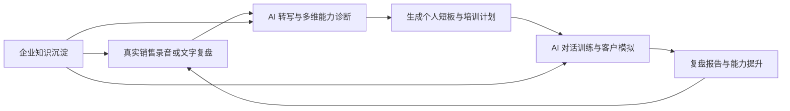
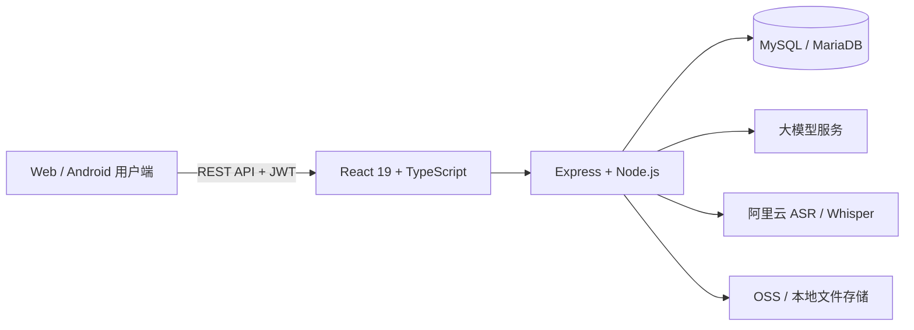

# AI 销售能力诊断陪练平台

> 用 AI 把销售培训从“统一听课”升级为“真实业务诊断、针对性陪练、持续复盘提升”。

## 项目简介

AI 销售能力诊断陪练平台是一套面向企业销售团队的智能培训系统。平台围绕销售人员的真实工作过程，将录音转写、能力评估、AI 客户模拟、个性化训练、产品知识学习和团队管理串联起来，形成从“发现问题”到“完成训练”再到“验证提升”的闭环。

平台不是单纯的聊天机器人，也不只是一个课程资料库。它更像一位能够理解企业产品知识、分析销售表现并持续陪练的数字教练。

## 项目要解决的问题

传统销售培训通常面临以下问题：

- 培训内容统一，但不同销售人员的能力短板并不相同；
- 主管依靠人工听录音、写点评，耗时且评价标准难以统一；
- 产品知识、销售话术和优秀案例分散，难以沉淀和复用；
- 培训结束后缺少持续练习，员工“知道怎么做”却不一定“能够说出来”；
- 管理者很难持续了解团队能力结构和训练效果。

本项目将真实销售录音、企业知识库和 AI 分析能力结合起来，为每位销售人员提供更具体、更及时、更可执行的训练建议。

## 核心业务闭环

这个闭环让培训内容直接来源于企业产品和实际销售场景，让训练重点直接来源于员工暴露出的真实问题。

## 核心功能

### 1. AI 销售能力诊断

销售人员可以上传真实谈单录音、直接录音，或输入对话文字。系统完成语音转写后，从知识覆盖、核心卖点命中、数据准确、话术匹配、表达结构和表达流畅度等维度进行分析，生成综合评分、问题定位和改进建议。

### 2. 针对薄弱点的 AI 对话训练

系统会根据诊断结果选择薄弱能力，自动生成有针对性的客户问题。员工完成每轮回答后，可获得即时评分和改进建议；后续问题还可以根据上一轮表现动态调整难度。

### 3. AI 客户情景模拟

员工可以选择客户角色、心理状态和对话难度，让 AI 扮演决策者、采购、技术顾问等不同类型的客户，演练需求挖掘、产品介绍、异议处理和成交推进。模拟结束后，系统会给出完整的对话表现评估。

### 4. 个性化培训计划

系统根据员工的评估结果生成个人培训计划，将薄弱点与相应的产品知识、销售话术、练习任务关联起来，让员工清楚知道“接下来学什么、练什么”。

### 5. 企业知识与产品资产管理

主管可以维护产品线、知识条目、标准话术、培训材料、图片和 PDF 文档。系统还能借助 AI 完成文字提取、内容分类、摘要生成、产品介绍生成和测验题生成，让零散资料转化为可检索、可学习、可用于评估的结构化知识。

### 6. 团队管理与运营监控

主管可以查看团队成员的练习记录、能力报告和优秀录音；管理员可以管理用户与角色、系统参数及运行数据。不同角色看到不同的数据和功能，满足企业内部的权限隔离需求。

## 三类用户

| 角色 | 主要使用方式 | 获得的价值 |
|---|---|---|
| 销售员工 | 学产品知识、上传谈单录音、查看报告、完成 AI 陪练 | 快速发现个人短板，获得可反复练习的私教式训练 |
| 销售主管 | 查看团队报告、推荐优秀案例、维护知识和产品素材 | 降低人工复盘成本，统一培训标准，掌握团队能力结构 |
| 系统管理员 | 管理用户权限、系统配置与运行状态 | 保证平台可控、数据隔离和日常运营稳定 |

## 项目特色

- **以真实业务为训练入口**：不只做通用问答，而是从真实销售录音和复盘中发现问题；
- **诊断与训练直接联动**：报告不是终点，系统会继续生成训练任务和模拟客户；
- **结合企业自己的知识**：分析、出题和对话可以引用企业产品资料与标准话术；
- **兼顾个人提升与团队管理**：员工练习、主管管理和管理员运营在同一平台内完成；
- **结果可解释**：通过多维评分、对话记录、问题示例和改进建议呈现 AI 判断依据；
- **支持多端使用场景**：前端采用响应式设计，仓库同时包含 Web 应用和 Android 容器工程。

## 技术实现

| 层级 | 主要技术 |
|---|---|
| 前端 | React 19、TypeScript、Vite、Tailwind CSS、Zustand、React Router、Recharts |
| 移动端 | Capacitor、Android 工程 |
| 后端 | Node.js、Express、TypeScript、Zod、Pino |
| 数据层 | MySQL / MariaDB、对象存储 |
| AI 能力 | 大模型对话与分析、语音识别、文档与图片文字提取 |
| 安全与权限 | JWT、角色权限控制、接口限流、Helmet、密码加密 |

## 适用场景

- 新销售入职后的产品知识学习与话术训练；
- 销售团队日常录音抽检和自动复盘；
- 新产品发布后的集中学习与在线测验；
- 针对典型异议、重点客户或特殊场景的模拟演练；
- 主管了解团队共性短板，制定下一阶段培训重点；
- 沉淀优秀录音、标准话术和企业销售方法论。

## 项目价值

对销售人员而言，平台提供了可以随时使用、允许反复试错的 AI 教练；对主管而言，它把大量重复的听录音、写点评工作转化为标准化的自动分析；对企业而言，它能够将分散在文档、图片、课程和个人经验中的销售知识沉淀为可持续复用的数字资产。

最终目标是让销售培训从一次性的课程，变成与每次真实业务共同发生的持续能力提升过程。
